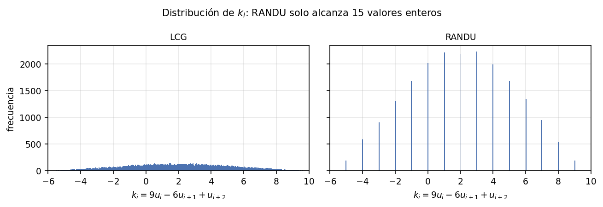

<div align="center">

# Números Pseudoaleatorios y Métodos de Monte Carlo

**Tarea 2 — Curso Libre de Configuración 2: Análisis de Datos**
Facultad de Ingeniería, Universidad del Istmo de Guatemala


**Herman Andrés Echeverría Rojas** · `hecheverria@unis.edu.gt`

---



*RANDU frente al LCG. La combinación $k_i = 9u_i - 6u_{i+1} + u_{i+2}$ toma en
RANDU exactamente **15 valores enteros** y en el LCG una distribución continua.
Ese es el defecto que ninguna prueba de hipótesis unidimensional detecta.*

</div>

## El informe

📄 **[`informe/main.pdf`](informe/main.pdf)** — 27 páginas, con la investigación
de las partes 1 y 2, las derivaciones y el análisis de los resultados.

El código fuente está en `informe/main.tex` y `informe/secciones/`. Todas las
figuras y tablas del documento las generan los scripts: ningún número está
transcrito a mano.

## Requisitos

- Python 3.10 o superior
- Una distribución de LaTeX (MiKTeX o TeX Live) para compilar el informe

```bash
py -m pip install -r requirements.txt
```

Se usan `numpy` para aritmética vectorizada, `scipy.stats` para los $p$-valores
de las distribuciones teóricas y `matplotlib` para graficar.

## Cómo ejecutar

Cada script reproduce una sección del informe:

```bash
py -m scripts.<nombre_del_script>
```

Para regenerar **todo** desde cero:

```bash
py -m scripts.p1_pruebas
py -m scripts.p1_espectral
py -m scripts.p1_cuadrados_medios
py -m scripts.p1_mersenne
py -m scripts.p1_bbs
py -m scripts.p1_tabla_comparativa
py -m scripts.p2_integrales
py -m scripts.p2_alta_dimension
py -m scripts.p2_varianza
py -m scripts.p2_randu
```

Y para compilar el documento (dos pasadas, para resolver referencias e índice):

```bash
cd informe
pdflatex main.tex
pdflatex main.tex
```

## Qué produce cada script

<details>
<summary><b>Tabla de scripts → figuras y tablas</b> (clic para desplegar)</summary>

<br>

| Script | Cubre | Figuras | Tablas |
|---|---|---|---|
| `laboratorio_semillas` | Diagnóstico del LCG | — | — |
| `p1_pruebas` | Incisos (a) y (b) + robustez | `hist_lcg_randu` · `pvalores` | `pruebas` · `robustez` |
| `p1_espectral` | Inciso (c) | `espectral_3d` · `espectral_k` | `espectral` |
| `p1_cuadrados_medios` | Cuadrados medios | `hist_cuadrados_medios` | `cm_censo` · `cm_pruebas` |
| `p1_mersenne` | MT19937 + inciso (d) | `hist_mersenne` | `mt_verificacion` · `mt_pruebas` · `comparacion_librerias` |
| `p1_bbs` | Blum Blum Shub | `hist_bbs` | `bbs_condiciones` · `bbs_pruebas` |
| `p1_tabla_comparativa` | Requisito 2 | — | `tabla_comparativa` |
| `p2_integrales` | §3.2 | `convergencia` | `mc_integrales` · `mc_pendientes` |
| `p2_alta_dimension` | §3.3 | `fraccion_volumen` | `mc_bola` · `mc_rejilla` · `mc_presupuesto` |
| `p2_varianza` | §3.4 | — | `mc_varianza` |
| `p2_randu` | §3.5 | `randu_convergencia` | `mc_randu` · `mc_randu_escala` |

Las figuras salen en `figuras/` como `.png` y las tablas en `resultados/` como
`.tex`, listas para que el documento las traiga con `\input{}`.

`laboratorio_semillas` no alimenta al documento: imprime en consola el
diagnóstico del LCG —verificación de Hull–Dobell, casos degenerados, cómo se
desploma el período de RANDU según la semilla, y la comprobación de la
identidad de tres términos.

</details>

## Estructura del código

<details>
<summary><b>Módulos del proyecto</b> (clic para desplegar)</summary>

<br>

| Ruta | Contenido |
|---|---|
| `semillas.py` | Registro central de **todas** las semillas |
| `prngs/lcg.py` | LCG y RANDU, más diagnóstico de período y Hull–Dobell |
| `prngs/middle_square.py` | Cuadrados medios (von Neumann) y censo de órbitas |
| `prngs/mersenne.py` | MT19937 completo: inicialización, torcedura y templado |
| `prngs/bbs.py` | Blum Blum Shub, Miller–Rabin y cálculo del período |
| `analisis/pruebas.py` | $\chi^2$, Kolmogórov–Smirnov, autocorrelación y rachas |
| `analisis/robustez.py` | Estudio de dos niveles y salto por forma cerrada |
| `analisis/espectral.py` | Ternas, conteo de planos y ángulo de vista |
| `analisis/salida.py` | Escritura de figuras y tablas `.tex` |
| `montecarlo/estimador.py` | Estimador de integrales con intervalo de confianza |
| `montecarlo/alta_dimension.py` | Volumen de la bola y cuadratura en rejilla |
| `montecarlo/varianza.py` | Variables antitéticas y de control |

</details>

Todos los generadores exponen la misma interfaz, `uniformes(n, semilla, ...)`,
lo que permite que la batería de pruebas, las figuras y los estimadores de
Monte Carlo funcionen con cualquiera de los cinco sin cambios.

## Reproducibilidad

Todas las semillas viven en `semillas.py`. Cada generador la recibe como
argumento y es completamente determinista: **misma semilla ⇒ misma secuencia**.

## Restricción del enunciado

No se usa `numpy.random` ni `random` como motor de ningún generador: los cinco
están implementados a partir de su recurrencia matemática. `random` y `secrets`
aparecen únicamente en la comparación que pide el inciso (d).

## Verificaciones

Cada generador se contrastó contra referencias publicadas antes de usarlo:

| Generador | Verificación |
|---|---|
| LCG | Hull–Dobell comprobado por fuerza bruta sobre las 256 semillas de $m=2^8$ |
| RANDU | Identidad $x_{n+2}=6x_{n+1}-9x_n \pmod{2^{31}}$ en las 9 998 ternas |
| Cuadrados medios | Secuencias publicadas de von Neumann ($43$) y el ciclo de $6100$ |
| MT19937 | Vector de referencia de la semilla $5489$ (OEIS A221557) |
| Blum Blum Shub | Período predicho contra período observado con primos seguros pequeños |

## Referencias

- Hull, T. E. y Dobell, A. R. (1962). *Random Number Generators*. SIAM Review, 4(3), 230–254.
- Marsaglia, G. (1968). *Random Numbers Fall Mainly in the Planes*. PNAS, 61(1), 25–28.
- Knuth, D. E. (1997). *The Art of Computer Programming, Vol. 2*, 3.ª ed., cap. 3.
- Matsumoto, M. y Nishimura, T. (1998). *Mersenne Twister*. ACM TOMACS, 8(1), 3–30.
- Blum, L., Blum, M. y Shub, M. (1986). *A Simple Unpredictable Pseudo-Random Number Generator*. SIAM J. Comput., 15(2), 364–383.
- NIST SP 800-22. *A Statistical Test Suite for Random and Pseudorandom Number Generators*.
